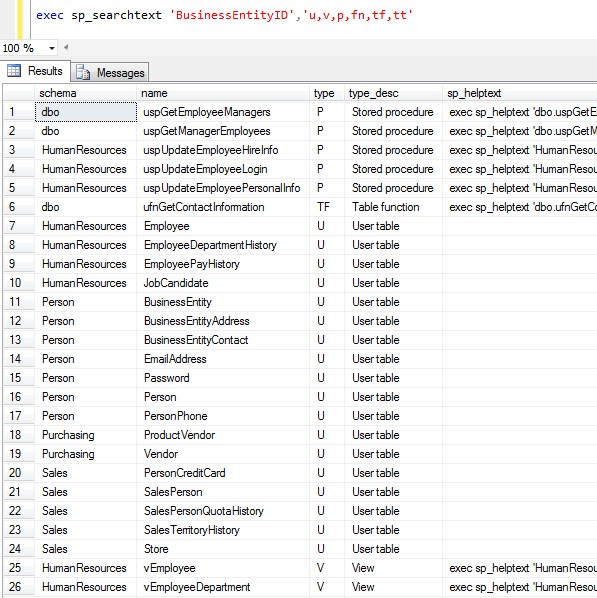
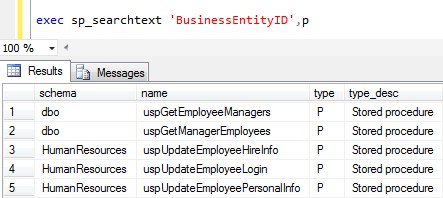
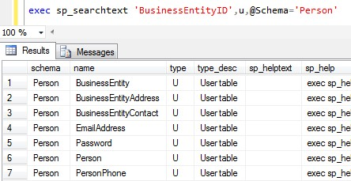
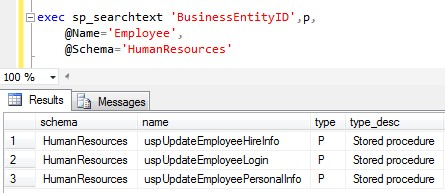
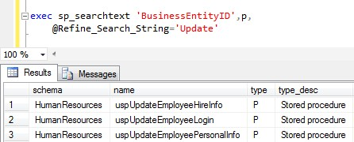

# SQL Server Text Search

Did you ever need to search for a string in your stored procedures? Or to search for a column name in all your user tables? There are many instances when you want to search your database for a given text during the course of programming.

At first, I started with a script. When in need, I pulled it up to SSMS, changed the value of the search string and executed. That got tired very quickly. What I was looking for is a more natural solution inherent to SSMS, meaning I can execute it in SSMS and get the results right below. Eventually the script evolved into a stored procedure with much more options than a script could contain without being cumbersome. For every SQL Server database that I worked on, I created this stored procedure and it's there whenever I need it.

Original article of [SQL Server Text Search on CodeProject](https://www.codeproject.com/Articles/1013634/SQL-Server-Text-Search "SQL Server Text Search on CodeProject").

## Installation

Open the script (or copy the text) in SSMS and create it (`CREATE PROCEDURE sp_searchtext`) on your database.

While this article explains the various aspects of this text search stored procedure with plenty of examples, I do find that there is nothing like trying it out for yourself. I strongly recommend that you create `sp_searchtext` in your test database and experiment with it. All following examples are executed on AdventureWorks2014 database.

```sql
exec sp_searchtext 'BusinessEntityID','u,v,p,fn,tf,tt'
```



## Parameters

- `@Search_String` - Text string to search for in the current database.
- `@Xtypes` - Comma-delimited list of object types that include and exclude (`-` prefix) what objects to search in.
- `@Case_Sensitive` - Whether the search is case sensitive or not. The default is case insensitive.
- `@Name` - Include objects that have `@Name` in their name.
- `@Schema` - Include objects that have `@Schema` in the name of their schema.
- `@Refine_Search_String` - Return results that have both `@Search_String` and `@Refine_Search_String`.
- `@Exclude_Name` - Exclude objects that have `@Exclude_Name` in their name.
- `@Exclude_Schema` - Exclude objects that have `@Exclude_Schema` in the name of their schema.
- `@Exclude_Search_String` - Exclude results that have `@Exclude_Search_String`.

There are no wildcards in `@Search_String` parameter or any other string parameters. All wildcard characters are treated as literal characters, so `%` and `_` are just regular characters like any other character.

`Xtype` is a type of object, denoted by a code of `char(2)`. MSDN has [a list of all types](https://learn.microsoft.com/en-us/sql/relational-databases/system-compatibility-views/sys-sysobjects-transact-sql "sys.sysobjects"). You don't have to memorize it all by heart. You'll remember the useful ones as you go along. Here's the most common ones:

- **U** - User table
- **V** - View
- **P** - Stored procedure
- **FN** - Scalar function
- **TF** - Table function
- **TT** - Table type

## Results

Each row is one object (table, view, stored procedure, function...) from the database. The columns are:

- **schema** - The schema of the object.
- **name** - The name of the object.
- **type** - The type of the object. Returns the `Xtype` code.
- **type_desc** - The type description of the object.
- **sp_helptext** - A script that gets the full text of the object.
- **sp_help** - A script that gets various details on the object. Very useful with user tables.
- **sp_columns** - A script that gets the object columns.
- **sysobjects** - A script that gets the object from `sys.sysobjects` table.
- **sp_searchtext** - A script to search for the name of the object.

Some scripts are not applicable for some object types so they will be empty in these cases.

## Simple Search

The query searches for `'BusinessEntityID'` in all objects. Since there's no type filtering it'll return user tables, views, stored procedures, functions, primary keys, foreign keys and more.

```sql
-- all objects with 'BusinessEntityID'
exec sp_searchtext 'BusinessEntityID'
```

The query returns only stored procedures (`p`) that have `'BusinessEntityID'` in them.

```sql
-- stored procedures with 'BusinessEntityID'
exec sp_searchtext 'BusinessEntityID',p
```



The query returns all types of objects except stored procedures  (`-p`) that have `'BusinessEntityID'` in them.

```sql
-- everything except stored procedures
exec sp_searchtext 'BusinessEntityID','-p'
```

The query is looking for specific objects types - user tables (`u`), views (`v`), stored procedures (`p`), scalar functions (`fn`), table functions (`tf`), table types (`tt`) - that have `'BusinessEntityID'`.

```sql
-- "interesting" objects
exec sp_searchtext 'BusinessEntityID','u,v,p,fn,tf,tt'
```

The query excludes primary keys (`-pk`), foreign keys (`-f`) and triggers (`-tr`) and returns every other object with `'BusinessEntityID'`.

```sql
-- everything except PKs, FKs, Triggers
exec sp_searchtext 'BusinessEntityID','-pk,-f,-tr'
```

These queries return everything or everything with the specified object type.

```sql
exec sp_searchtext ''   -- all objects
exec sp_searchtext '',u -- all user tables
exec sp_searchtext '',p -- all stored procedures
```

## Filter by Name & Schema

The first query searches for all user tables (`u`) that have at least one column with `'BusinessEntityID'` in the column name. The second query searches for all user tables (`u`), within the `Person` schema, that have at least one column with `'BusinessEntityID'` in the column name.

```sql
exec sp_searchtext 'BusinessEntityID',u
exec sp_searchtext 'BusinessEntityID',u,@Schema='Person'
```



The first query searches for all objects with `'BusinessEntityID'` and with `'Employee'` in their name. The second query searches for all stored procedures (`p`) with `'BusinessEntityID'` and with `'Employee'` in their name. The third query searches for all stored procedures (`p`) with `'BusinessEntityID'` and with `'Employee'` in their name and within the `HumanResources` schema.

```sql
exec sp_searchtext 'BusinessEntityID',@Name='Employee'
exec sp_searchtext 'BusinessEntityID',p,@Name='Employee'
exec sp_searchtext 'BusinessEntityID',p,@Name='Employee',@Schema='HumanResources'
```



## Case Sensitive & Insensitive Search

When the search is set to case sensitive, then all the string parameters are treated as case sensitive - `@Search_String`, `@Name`, `@Schema`, `@Refine_Search_String`...

The first four queries are the same, they return all objects with **case insensitive** `'BusinessEntityID'`. The last two queries return all objects with **case sensitive** `'BUSINESSENTITYID'`. Since there is no object with `'BUSINESSENTITYID'` they both return no results.

```sql
-- all objects with case insensitive 'BusinessEntityID'
exec sp_searchtext 'BusinessEntityID'
exec sp_searchtext 'BUSINESSENTITYID'
exec sp_searchtext 'BUSINESSENTITYID','',0
exec sp_searchtext 'BUSINESSENTITYID',@Case_Sensitive=0

-- all objects with case sensitive 'BUSINESSENTITYID'
exec sp_searchtext 'BUSINESSENTITYID','',1
exec sp_searchtext 'BUSINESSENTITYID',@Case_Sensitive=1
```

## Refine & Exclude Search

The query searches for stored procedures (`p`) with `'BusinessEntityID'` **and** with `'Update'`. The `@Refine_Search_String` parameter searches for a second string and refines the returned results.

```sql
exec sp_searchtext 'BusinessEntityID',p,
    @Refine_Search_String='Update'
```



The query uses all three exclude parameters to search for stored procedures (`p`) with `'BusinessEntityID'` that don't have `'Update'` in their name, don't have `'HumanResources'` in their schema name, and don't have the string `'Update'` in their text.

```sql
exec sp_searchtext 'BusinessEntityID',p,
    @Exclude_Name='Update',
    @Exclude_Schema='HumanResources',
    @Exclude_Search_String='Update'
```

## Implementation

The system tables that `sp_searchtext` uses are:

- [sys.sysobjects](https://learn.microsoft.com/en-us/sql/relational-databases/system-compatibility-views/sys-sysobjects-transact-sql "sys.sysobjects") - The database user-defined objects.
- [sys.schemas](https://learn.microsoft.com/en-us/sql/relational-databases/system-catalog-views/schemas-catalog-views-sys-schemas "sys.schemas") - The database schemas.
- [sys.columns](https://learn.microsoft.com/en-us/sql/relational-databases/system-catalog-views/sys-columns-transact-sql "sys.columns") - The database columns (User tables, Views, Table functions).
- [sys.table_types](https://learn.microsoft.com/en-us/sql/relational-databases/system-catalog-views/sys-table-types-transact-sql "sys.table_types") - The properties of the database's table types.
- [sys.syscomments](https://learn.microsoft.com/en-us/sql/relational-databases/system-compatibility-views/sys-syscomments-transact-sql "sys.syscomments") - The SQL definition statements of the database objects.

The most interesting column is the `text` column in `sys.syscomments`. The `text` column holds the text definition statement of an object. This is where you would find the text of stored procedures, views and other objects. The `text` column is defined as `nvarchar(4000)`, so if the definition statement of an object, for example a stored procedure, has a lenght of more than 4000 characters, there would be several entries in `sys.syscomments` that are associated with that object. The `colid` column holds the order of the entries in `sys.syscomments`.

This is the key script at the heart of `sp_searchtext`. The script makes a link between an object in `sys.sysobjects` and its SQL definitions in `sys.syscomments` (if it has any). Once it get that essential information - type, name, schema and text - it can start testing it for other things.

```sql
-- objects
select distinct
    so.id,                -- object id
    so.xtype,             -- object type
    [schema] = ss.[name], -- object schema
    so.[name],            -- object name
    sc.colid,             -- order of object definitions
    sc.[text]             -- object definition
from sys.sysobjects so
inner join sys.schemas ss on so.[uid] = ss.[schema_id]
left outer join sys.syscomments sc on so.id = sc.id
order by xtype, [schema], [name], colid
```

Since columns do not appear in `sys.sysobjects`, this script augments the previous one by taking the columns from `sys.columns` and link them to their owners from `sys.sysobjects`.

```sql
-- columns
select distinct
    so.id,                 -- object id
    so.xtype,              -- object type
    [schema] = ss.[name],  -- object schema
    so.[name],             -- object name
    c.column_id,           -- columns order
    column_name = c.[name] -- column name
from sys.columns c
inner join sys.sysobjects so on c.[object_id] = so.id
inner join sys.schemas ss on so.[uid] = ss.[schema_id]
order by xtype, [schema], [name], column_id
```

Last word about the implementation of the case sensitive search. If you remember your SQL Server collations, a collation is a set of rules that governs how a set of characters are sorted and compared. A set of characters can be a language (e.g. Greek) or an alphabet (e.g. Latin). The set of rules include case sensitivity (A vs. a), Accent sensitivity (a vs. á), Kana Sensitivity (Hiragana vs. Katakana Japanese kana characters) and  Width sensitivity (single-byte vs. double-byte). There are several levels of collation. The outermost is server, then database, then column and then the innermost is a SQL expression. The rule is the inner one trumps up the outer one. The way I implemented a case sensitive search is to collate every `LIKE` clause with `Latin1_General_BIN`.

```sql
-- part of a WHERE clause
so.name collate Latin1_General_BIN like '%'+@Search_String+'%' collate Latin1_General_BIN
sc.text collate Latin1_General_BIN like '%'+@Search_String+'%' collate Latin1_General_BIN
```

The 'BIN' in `Latin1_General_BIN` stands for Binary. A binary collation sorts and compares data based on the bit pattern for each character. Since every character has a different binary value from any other character, that implies case sensitive (and accent sensitive) sortation.